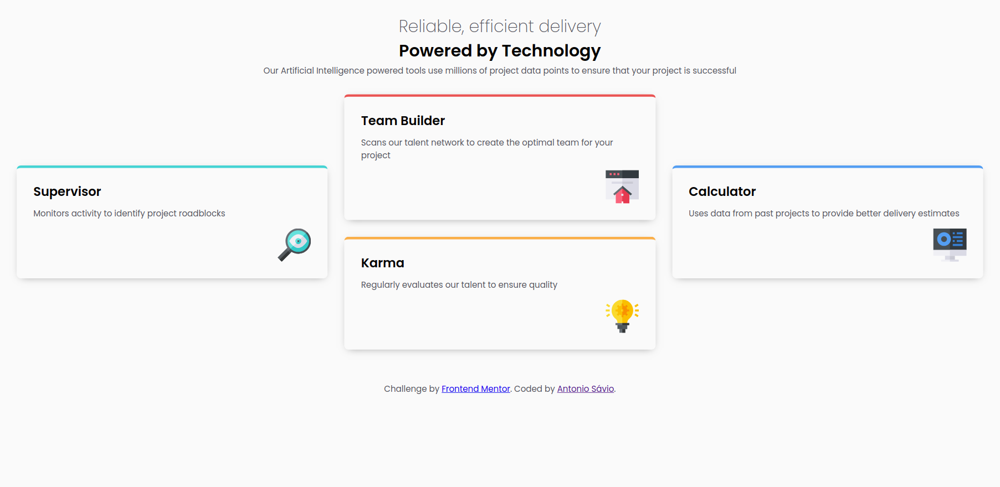
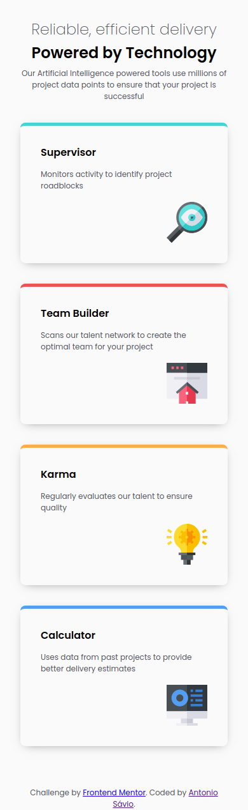

# Frontend Mentor - Four card feature section solution

This is a solution to the [Four card feature section challenge on Frontend Mentor](https://www.frontendmentor.io/challenges/four-card-feature-section-weK1eFYK). Frontend Mentor challenges help you improve your coding skills by building realistic projects.

## Table of contents

- [Overview](#overview)
  - [The challenge](#the-challenge)
  - [Built with](#built-with)
  - [What I learned](#what-i-learned)
- [Solution](#solution)
- [Author](#author)

**Note: Delete this note and update the table of contents based on what sections you keep.**

## Overview

### The challenge

Users should be able to:

- View the optimal layout for the site depending on their device's screen size

### Built with

- VS Code and Live Server + Others extensions
- Semantic HTML5 markup
- CSS custom properties
- CSS Flex box
- CSS Grid
- Mobile-first workflow

### What I learned

- Improve English;
- Organize the project with markdown. If you want more help with writing markdown, I'd recommend checking out [The Markdown Guide](https://www.markdownguide.org/) to learn more.
- CSS Grid;

I used this chalenge to test a styling technique for responsive fonts by using the `clamp` css function. [clamp() MDN documentation](https://www.markdownguide.org/)

```css
:root {
  --bp-tablet: 768;
  --bp-desktop: 1440;
}

body {
  font-size: clamp(
    calc(1px * var(--font-size-mobile)),
    calc(1vw * calc((var(--font-size-tablet) * 100 / var(--bp-tablet)))),
    calc(1px * var(--font-size-desktop))
  );
}
```

`clamp(MIN, MIDDLE, MAX)` Basically, the **MIN** and **MAX** values will be defined. The **MIDDLE** value will be defined using the `VW CSS Unit` and calculated by: FONT_SIZE \* 100 / BREAKPOINT. FONT_SIZE is the desired value of the font in a BREAKPOINT between mobile and desktop.

This is something that still needs to be refined.

### Solution

#### Desktop



#### Tablet


#### Mobile



## Author

- Frontend Mentor - [@SavioSantosDev](https://www.frontendmentor.io/profile/SavioSantosDev)
- Linkedin - [Antonio Sávio](https://www.linkedin.com/in/savio-santos-dev/)
